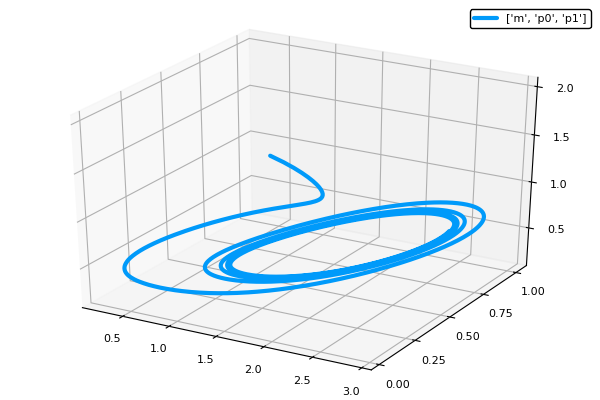

# Circadian Simulation

Author: Shao-Ting Chiu (stevengogogo4321@gmail.com)

---
## Abstract

## Outline

*Source: Ingalls, B. P. (2013). *

## Simulation

|Time Series|Phase Plot|
|---|---|
|||

## Installation
1. 

## References
1. Ingalls, B. P. (2013). Mathematical modeling in systems biology: an introduction. MIT press. ([link](https://books.google.com.tw/books?hl=zh-TW&lr=&id=OYr6AQAAQBAJ&oi=fnd&pg=PR5&dq=Ingalls,+B.+Mathematical+Modeling+in+Systems+Biology+-+an+Introduction.&ots=ucgsG0-NAA&sig=gXJPRtpiAQDzyLYYcGOT5CQBFVc&redir_esc=y#v=onepage&q=Ingalls%2C%20B.%20Mathematical%20Modeling%20in%20Systems%20Biology%20-%20an%20Introduction.&f=false))
2. Goldbeter, A. (1997). Biochemical oscillations and cellular rhythms: the molecular bases of periodic and chaotic behaviour. Cambridge university press. ([link](https://books.google.com.tw/books?hl=en&lr=&id=dKk0I-KMDJIC&oi=fnd&pg=PP1&ots=WVtd4X2-1N&sig=9pWRpEfrLnXo7kqvaTOfQBCpMUU&redir_esc=y#v=onepage&q&f=false))